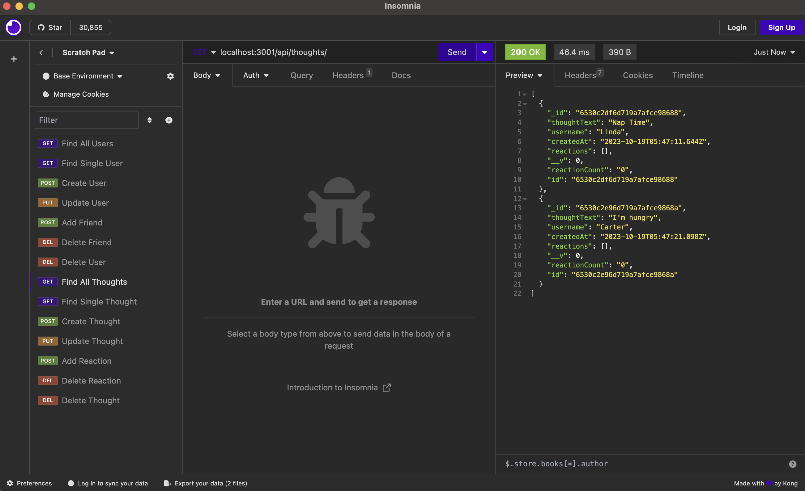

# social-network-api

## Description
The motive behind this project was to build an API for a social network web application where users can share their thoughts, react to friends’ thoughts, and create a friend list. I learned how to create models and implement CRUD through mongoose, and I also learned how to make GET/POST/PUT/DELETE requests using Insomnia. 
 
## Installation
1. Clone from repo.
2. Open folder with visual studio code or any text editor of choice.
3. Run 'npm i' to install packages
4. Run ‘node server‘ in terminal to run code.

## Usage
1. Open repo in terminal.
2. Run 'npm i' to install packages
3. Run ‘node server’ to start application
4. Open localhost port using Insomnia
5. Make GET/POST/PUT/DELETE requests

## Video Demo Link
[Click here for Demo Video](https://drive.google.com/file/d/1dfoJe0MKiV8gqlVuCYktVfDEyd51niUc/view?usp=sharing)